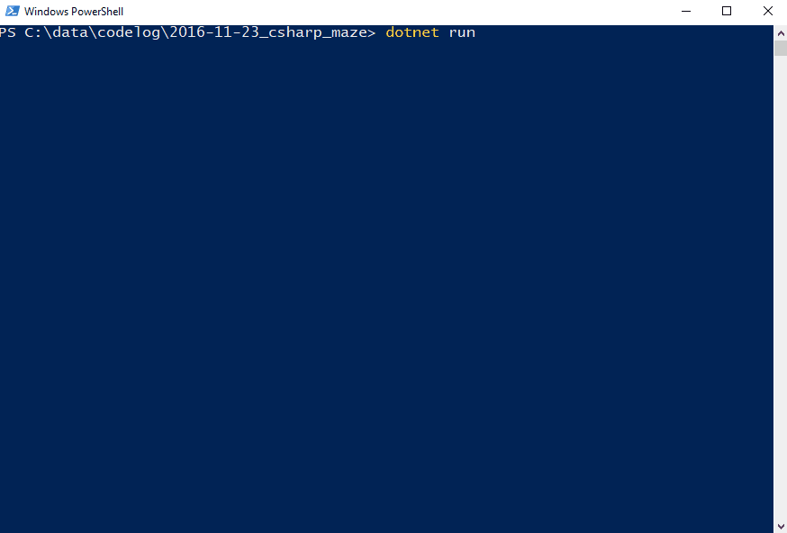

## Maze Generator and Solver

This is a simple console app that I made for fun that generates a random maze and then solves it.

The solver uses Depth First Search and the generator uses [Recursive Backtracking](http://weblog.jamisbuck.org/2010/12/27/maze-generation-recursive-backtracking)



## To Run Python Version

```bash
cd python
python ./maze.py
```

## To Run Dotnet Version

```bash
cd csharp
dotnet run
```
